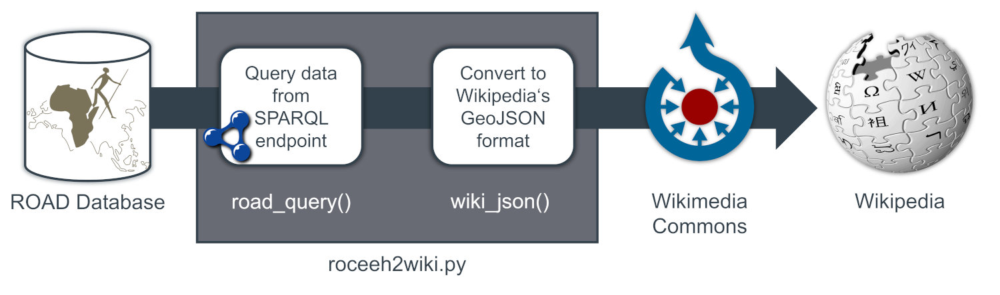
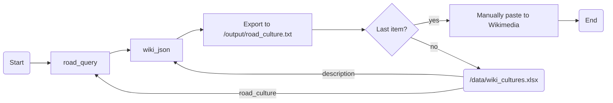

# roceeh2wiki
This repo contains tools to publish geodata from the [ROCEEH Out of Africa Database (ROAD)](https://www.roceeh.uni-tuebingen.de/roadweb/smarty_road_simple_search.php) to Wikipedia maps. The tools help to query data from ROAD's [SPARQL](http://www.roceeh.uni-tuebingen.de/roadweb/smarty_sparql_select.php "Must be logged in to enter webform") endpoint and convert the results to the JSON schema of Wikipedia's map extension [Kartographer](https://www.mediawiki.org/wiki/Help:Extension:Kartographer).
The JSON files can be pasted to Wikimedia Commons, which then are linked to Wikis.
 



## Results
The following Wikis are currently provided:

|ROAD Content   |Wikimedia                                                                 |Wikipedia                                                                                                                 |
|---------------|--------------------------------------------------------------------------|--------------------------------------------------------------------------------------------------------------------------|
|Early Stone Age|[Link](https://commons.wikimedia.org/wiki/Data:ROCEEH/Early_Stone_Age.map)| |
|Middle Stone Age|[Link](https://commons.wikimedia.org/wiki/Data:ROCEEH/Middle_Stone_Age.map)|[en](https://en.wikipedia.org/wiki/Middle_Stone_Age)|
|Later Stone Age|[Link](https://commons.wikimedia.org/wiki/Data:ROCEEH/Later_Stone_Age.map)|[en](https://en.wikipedia.org/wiki/Late_Stone_Age)|
|Lower Paleolithic|[Link](https://commons.wikimedia.org/wiki/Data:ROCEEH/Lower_Paleolithic.map)|[en](https://en.wikipedia.org/wiki/Lower_Paleolithic)|
|Middle Paleolithic|[Link](https://commons.wikimedia.org/wiki/Data:ROCEEH/Middle_Paleolithic.map)|[en](https://en.wikipedia.org/wiki/Middle_Paleolithic)|
|Upper Paleolithic|[Link](https://commons.wikimedia.org/wiki/Data:ROCEEH/Upper_Paleolithic.map)|[en](https://en.wikipedia.org/wiki/Upper_Paleolithic)|
|Ahmarian       |[Link](https://commons.wikimedia.org/wiki/Data:ROCEEH/Ahmarian.map)       | |
|Aterian        |[Link](https://commons.wikimedia.org/wiki/Data:ROCEEH/Aterian.map)        |[en](https://en.wikipedia.org/wiki/Aterian) [de](https://de.wikipedia.org/wiki/At%C3%A9rien) [fr](https://fr.wikipedia.org/wiki/At%C3%A9rien) [it](https://it.wikipedia.org/wiki/Cultura_ateriana) [es](https://es.wikipedia.org/wiki/Ateriense) [pt](https://pt.wikipedia.org/wiki/Cultura_ateriana)|
|Aurignacian    |[Link](https://commons.wikimedia.org/wiki/Data:ROCEEH/Aurignacian.map)    | [en](https://en.wikipedia.org/wiki/Aurignacian) |
|Chatelperronian|[Link](https://commons.wikimedia.org/wiki/Data:ROCEEH/Chatelperronian.map)|[en](https://en.wikipedia.org/wiki/Ch%C3%A2telperronian) [de](https://de.wikipedia.org/wiki/Ch%C3%A2telperronien) [fr](https://fr.wikipedia.org/wiki/Ch%C3%A2telperronien) [it](https://it.wikipedia.org/wiki/Castelperroniano) [es](https://es.wikipedia.org/wiki/Ch%C3%A2telperroniense) [pt](https://pt.wikipedia.org/wiki/Chatelperronense)|
|Early Upper Paleolithic    |[Link](https://commons.wikimedia.org/wiki/Data:ROCEEH/Early_Upper_Paleolithic.map)    | |
|Fauresmith     |[Link](https://commons.wikimedia.org/wiki/Data:ROCEEH/Fauresmith.map)     |[en](https://en.wikipedia.org/wiki/Fauresmith_(industry)) [de](https://de.wikipedia.org/wiki/Fauresmith-Industrie) [fr](https://fr.wikipedia.org/wiki/Fauresmithien) [es](https://es.wikipedia.org/wiki/Fauresmithiense)|
|Gravettian     |[Link](https://commons.wikimedia.org/wiki/Data:ROCEEH/Gravettian.map)     |[en](https://en.wikipedia.org/wiki/Gravettian) [de](https://de.wikipedia.org/wiki/Gravettien) [fr](https://fr.wikipedia.org/wiki/Gravettien)  [it](https://it.wikipedia.org/wiki/Gravettiano) [es](https://es.wikipedia.org/wiki/Gravetiense) [pt](https://pt.wikipedia.org/wiki/Per%C3%ADodo_Gravetiano)|
|Howiesonspoort |[Link](https://commons.wikimedia.org/wiki/Data:ROCEEH/Howiesonspoort.map) |[en](https://en.wikipedia.org/wiki/Howiesons_Poort) [de](https://de.wikipedia.org/wiki/Howieson%E2%80%99s_Poort_Industrie) [fr](https://fr.wikipedia.org/wiki/Howiesons_Poort) [it](https://it.wikipedia.org/wiki/Howiesons_Poort) |
|Initial Upper Paleolithic    |[Link](https://commons.wikimedia.org/wiki/Data:ROCEEH/Initial_Upper_Paleolithic_Eurasia.map)    | |
|Levantine Aurignacian    |[Link](https://commons.wikimedia.org/wiki/Data:ROCEEH/Levantine_Aurignacian.map)    | |
|Micoquian      |[Link](https://commons.wikimedia.org/wiki/Data:ROCEEH/Micoquian.map)      |[en](https://en.wikipedia.org/wiki/Micoquien) [de](https://de.wikipedia.org/wiki/Micoquien) [fr](https://fr.wikipedia.org/wiki/Micoquien) [es](https://es.wikipedia.org/wiki/Micoquiense)|
|Proto-Aurignacian    |[Link](https://commons.wikimedia.org/wiki/Data:ROCEEH/Proto_Aurignacian.map)    | |
|Solutrean      |[Link](https://commons.wikimedia.org/wiki/Data:ROCEEH/Solutrean.map)      ||
|Still Bay      |[Link](https://commons.wikimedia.org/wiki/Data:ROCEEH/Still_Bay.map)      |[en](https://en.wikipedia.org/wiki/Stillbay) [fr](https://fr.wikipedia.org/wiki/Stillbay) [es](https://es.wikipedia.org/wiki/Stillbayense)|
|Uluzzian       |[Link](https://commons.wikimedia.org/wiki/Data:ROCEEH/Uluzzian.map)       |[en](https://en.wikipedia.org/wiki/Uluzzian) [de](https://de.wikipedia.org/wiki/Uluzzien) [fr](https://fr.wikipedia.org/wiki/Uluzzien) [es](https://es.wikipedia.org/wiki/Cultura_Uluzziana) [pt](https://pt.wikipedia.org/wiki/Cultura_Uluzziana) |
|Early fire use|[Link](https://commons.wikimedia.org/wiki/Data:ROCEEH/Early_fire.map)|[en](https://en.wikipedia.org/wiki/Fire)|
|Ochre use|[Link](https://commons.wikimedia.org/wiki/Data:ROCEEH/Ochre.map)|[en](https://en.wikipedia.org/wiki/Ochre)|
|Eyed needle use|[Link](https://commons.wikimedia.org/wiki/Data:ROCEEH/Eyed_needle.map)|[en: Sewing needle](https://en.wikipedia.org/wiki/Sewing_needle)[en: Bone tool](https://en.wikipedia.org/wiki/Bone_tool)|
|Sahelanthropus tchadensis|[Link](https://commons.wikimedia.org/wiki/Data:ROCEEH/Sahelanthropus_tchadensis.map)| |
|Ardipithecus ramidus and kadaba|[Link](https://commons.wikimedia.org/wiki/Data:ROCEEH/Ardipithecus_ramidus_and_kadaba.map)| |
|Australopithecus afarensis|[Link](https://commons.wikimedia.org/wiki/Data:ROCEEH/Australopithecus_afarensis.map)| |
|Australopithecus africanus|[Link](https://commons.wikimedia.org/wiki/Data:ROCEEH/Australopithecus_africanus.map)| |
|Paranthropus boisei|[Link](https://commons.wikimedia.org/wiki/Data:ROCEEH/Paranthropus_boisei.map)| |
|Homo rudolfensis|[Link](https://commons.wikimedia.org/wiki/Data:ROCEEH/Homo_rudolfensis.map)| |
|Homo habilis|[Link](https://commons.wikimedia.org/wiki/Data:ROCEEH/Homo_habilis.map)| |
|Homo erectus|[Link](https://commons.wikimedia.org/wiki/Data:ROCEEH/Homo_erectus.map)| |
|Homo ergaster|[Link](https://commons.wikimedia.org/wiki/Data:ROCEEH/Homo_ergaster.map)| |
|Homo heidelbergensis|[Link](https://commons.wikimedia.org/wiki/Data:ROCEEH/Homo_heidelbergensis.map)| |
|Homo sapiens neanderthalensis|[Link](https://commons.wikimedia.org/wiki/Data:ROCEEH/Homo_sapiens_neanderthalensis.map)| |
|Homo sapiens|[Link](https://commons.wikimedia.org/wiki/Data:ROCEEH/Homo_sapiens.map)| |

## Use

The program uses the script [roceeh2wiki.py](/script/roceeh2wiki.py) to iterate through [wiki_cultures.xlsx](/data/wiki_cultures.xlsx), a list of archaeological cultures to be queried from the ROAD database and published on Wikpedia. The spreadsheet contains 5 columns:
* `use` indicates whether a culture should be queried or not. We aim to provide a high level of quality and ask specialists to evaluate the resulting maps. Therefore the maps are released step by step.
* `enwiki_title` and `enwiki_title` are Wikis in the German and English speaking Wikipedia that correspond to cultures stored in ROAD. They are the targets of our maps.
* `road_culture` contains cultures to be queried from the ROAD attribute `archaeological_layer$archstratigraphy_idarchstrat` (or its RDF realisation `road:ArchaeologicalLayer\#archstratigraphyIdArchstrat`).
* `description` contains a JSON styled dictionary with the maps names in different languages.

For each row that is flagged `use==T`, the script creates an output TXT file containing a Wikipedia-flavoured JSON into the output folder. This JSON can be manually exported to Wikimedia Commons `https://commons.wikimedia.org/wiki/Data:ROCEEH/*.map`. The Wikimedia Commons file is then linked within the target Wiki's `<mapframe>`. _It is planned to replace this manual last step in Wiki with a wikibot._ 

```
.
├── scripts                  
│   └── roceeh2wiki.py       # Query cultures from ROAD and export to JSON
├── data
│   └── wiki_cultures.xlsx   # List with ROAD cultures and corresponding Wikis to process
└── output
    ├── Ahmarian.txt 	     # 1st culture
    ├── Aterian.txt 	     # 2nd culture
    └── ...		     # Many more results
```



## Background

### Maps in Wikipedia

Web maps are implemented in Wikipedia by a `<mapframe>` element. The element's `text` argument is used as a subtitle of the map and cotains a name in the repsective language, the license and the source name. The mapframe points to a Wikimedia Commons file, referenced in the `"title"` tag.


```html
<mapframe text="Selected Uluzzian sites from the [https://www.roceeh.uni-tuebingen.de/roadweb ROAD database] (CC BY-SA 4.0 ROCEEH)" longitude="16.3" latitude="41.5" zoom="5" width="450", height="350">
{
  "type": "ExternalData",
  "service": "page",
  "title": "ROCEEH/Uluzzian.map"
}
</mapframe>
```

### Geodata in Wikimedia Commons
Geodata for Wikipedia are collected in Wikimedia Commons for two reasons. First, GeoJSON files can be excessively long depending on its content, so that it disturbs the readability in the Wikipedia text editor. Second, contents in Wikimedia Commons can be accessed from Wikis in all languages, no cross-posting needed.


#### URL
All ROAD contents follow the URL-Schema `https://commons.wikimedia.org/wiki/Data:ROCEEH/*.map`, where  `*` denotes the content title. This file is accessible within Wikipedia as `ROCEEH/*.map`.

#### JSON
The following code is an exemple from the Uluzzian culture, and was shortened to show just one site, "Uluzzo C". The Kartographer schema uses a JSON file, which can be divided into general map information and geodata.

- General map information:
	- The `"license"` for all ROAD data is [CC BY-SA 4.0](https://www.roceeh.uni-tuebingen.de/roadweb/smarty_data_use_policy.php) and therefore complies with Wikipedia's terms of use. 
	- The `"description"` is shown in Wikimedia Commons as a subheading. Different languages can be used to translate to the target Wiki's title, e.g. English "Uluzzian" vs. German "Uluzzien".
	- The `"sources"` tag is a standard text. The date of export is updated automatically.
	- The tags `"zoom"`, `"latitude"` and `"longitude"` are optional and can be used to set the map's initial extent. The map engine however is smart enough to set a suitable extent automatically.
- Geodata:
	- The `"data"` tag is at the heart of Wikipedia's JSON scheme and contains a standard GeoJSON file. Most of its contents are standardized. The appearance of the popup is defined in the features' `"properties"`. 
		- The `"title"` contains the name of the site as exported from ROAD. _It is planned to optionally link to other Wikis, where available._ 
		- The `"description"` always contains a link to the site's [Summary Data Sheet](https://www.roceeh.uni-tuebingen.de/roadweb/tcpdf/localityInfoPDF/localityInfoPDF.php?locality=Uluzzo%20C), a PDF generated with the URL `https://www.roceeh.uni-tuebingen.de/roadweb/tcpdf/localityInfoPDF/localityInfoPDF.php?locality=*`, where `*` denotes the site's name. _It is planned to optionally include existing Wikipedia images and other contents, where available._
```json
{
    "license": "CC-BY-SA-4.0",
    "description": {
        "de": "Fundstellen des Uluzzien",
        "en": "Uluzzian sites"
    },
    "sources": "Data retrieved from the [https://www.roceeh.uni-tuebingen.de/roadweb ROCEEH Out Of Africa Database (ROAD)].",
    "zoom": 5,
    "latitude": 41.5,
    "longitude": 16.3,
    "data": {
        "type": "FeatureCollection",
        "name": "uluzzian_road",
        "crs": {
            "type": "name",
            "properties": {
                "name": "urn:ogc:def:crs:OGC:1.3:CRS84"
            }
        },
        "features": [
            {
                "type": "Feature",
                "properties": {
                    "title": "Uluzzo C",
                    "description": "[[File:Grotta di Uluzzo C 4.jpg|150px|alt=Grotta di Uluzzo C]]</br>[https://www.roceeh.uni-tuebingen.de/roadweb/tcpdf/localityInfoPDF/localityInfoPDF.php?locality=Uluzzo%20C Summary Data Sheet]"
                },
                "geometry": {
                    "type": "Point",
                    "coordinates": [
                        17.96,
                        40.15
                    ]
                }
            }
        ]
    }
}
```

### ROAD SPARQL endpoint
The ROAD database is implemented as a relational SQL database, that can be accessed through a [web portal](https://www.roceeh.uni-tuebingen.de/roadweb/smarty_road_simple_search.php) with many tools for querying, analyzing and visualizing. But the database is also regularly exported to RDF files, that can be queried through ROAD's **SPARQL endpoint** at `https://www.roceeh.uni-tuebingen.de/road/`. 


SPARQL queries can be requested through a [web interface](http://www.roceeh.uni-tuebingen.de/roadweb/smarty_sparql_select.php), which allows to export results to a HTML table, JSON, XML or CSV file. The following example shows a query for archaeological sites associated with the Uluzzian culture and returns their names and geocoordinates. Roceeh2wiki uses the Python library [sparql-dataframe](https://github.com/lawlesst/sparql-dataframe) to request data directly.


```sparql
PREFIX road: <https://www.roceeh.uni-tuebingen.de/road/>
PREFIX wgs84_pos: <https://www.w3.org/2003/01/geo/wgs84_pos#>

SELECT  DISTINCT (?culture) ?title ?lon ?lat
WHERE {
  ?x a road:ArchaeologicalLayer.
  ?x road:ArchaeologicalLayer\#archstratigraphyIdArchstrat "Uluzzian".
  ?x road:ArchaeologicalLayer\#localityId ?title.
  ?y a road:Locality.
  ?y road:Locality\#id ?title.
  ?y wgs84_pos:long ?lon.
  ?y wgs84_pos:lat ?lat.
} ORDER BY ?title
```
