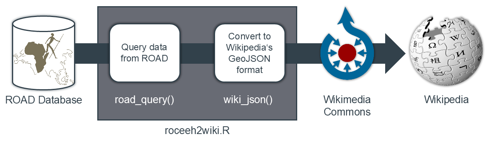

# roceeh2wiki
This repo contains tools to publish geodata from the [ROCEEH Out of Africa Database (ROAD)](https://www.roceeh.uni-tuebingen.de/roadweb/smarty_road_simple_search.php) to Wikipedia maps. The tools help to query data from ROAD's R interface and convert the results to the JSON schema of Wikipedia's map extension [Kartographer](https://www.mediawiki.org/wiki/Help:Extension:Kartographer).
The JSON files can be uploaded to Wikimedia Commons and referenced within Wikipedia.

Interactive maps derived from ROAD are reviewed by colleagues with scientific expertise and, once approved, published on Wikipedia. The criterion here is not absolute completeness, as the ROAD database and the state of scientific knowledge are constantly changing, but rather a “representative picture” of the current state of research. The data is updated regularly.



## Results
The following Wikis are currently provided:

|ROAD Content   |Wikimedia	|Wikipedia|
|---------------|-----------|---------|
|Early Stone Age|[Link](https://commons.wikimedia.org/wiki/Data:ROCEEH/Early_Stone_Age.map)|~~en~~ |
|Middle Stone Age|[Link](https://commons.wikimedia.org/wiki/Data:ROCEEH/Middle_Stone_Age.map)|[en](https://en.wikipedia.org/wiki/Middle_Stone_Age)|
|Later Stone Age|[Link](https://commons.wikimedia.org/wiki/Data:ROCEEH/Later_Stone_Age.map)|[en](https://en.wikipedia.org/wiki/Late_Stone_Age)|
|Lower Paleolithic|[Link](https://commons.wikimedia.org/wiki/Data:ROCEEH/Lower_Paleolithic.map)|[en](https://en.wikipedia.org/wiki/Lower_Paleolithic)|
|Middle Paleolithic|[Link](https://commons.wikimedia.org/wiki/Data:ROCEEH/Middle_Paleolithic.map)|[en](https://en.wikipedia.org/wiki/Middle_Paleolithic)|
|Upper Paleolithic|[Link](https://commons.wikimedia.org/wiki/Data:ROCEEH/Upper_Paleolithic.map)|[en](https://en.wikipedia.org/wiki/Upper_Paleolithic)|
|Acheulean      |[Link](https://commons.wikimedia.org/wiki/Data:ROCEEH/Acheulean.map)|
|Ahmarian       |[Link](https://commons.wikimedia.org/wiki/Data:ROCEEH/Ahmarian.map)       | |
|Aterian        |[Link](https://commons.wikimedia.org/wiki/Data:ROCEEH/Aterian.map)        |[en](https://en.wikipedia.org/wiki/Aterian) [de](https://de.wikipedia.org/wiki/At%C3%A9rien) [fr](https://fr.wikipedia.org/wiki/At%C3%A9rien) [it](https://it.wikipedia.org/wiki/Cultura_ateriana) [es](https://es.wikipedia.org/wiki/Ateriense) [pt](https://pt.wikipedia.org/wiki/Cultura_ateriana)|
|Aurignacian    |[Link](https://commons.wikimedia.org/wiki/Data:ROCEEH/Aurignacian.map)    | [en](https://en.wikipedia.org/wiki/Aurignacian) [de](https://de.wikipedia.org/wiki/Aurignacien) [fr](https://fr.wikipedia.org/wiki/Aurignacien) [it](https://it.wikipedia.org/wiki/Aurignaziano) [es](https://es.wikipedia.org/wiki/Auri%C3%B1aciense) [pt](https://pt.wikipedia.org/wiki/Per%C3%ADodo_Aurignaciano)|
|Chatelperronian|[Link](https://commons.wikimedia.org/wiki/Data:ROCEEH/Chatelperronian.map)|[en](https://en.wikipedia.org/wiki/Ch%C3%A2telperronian) [de](https://de.wikipedia.org/wiki/Ch%C3%A2telperronien) [fr](https://fr.wikipedia.org/wiki/Ch%C3%A2telperronien) [it](https://it.wikipedia.org/wiki/Castelperroniano) [es](https://es.wikipedia.org/wiki/Ch%C3%A2telperroniense) [pt](https://pt.wikipedia.org/wiki/Chatelperronense)|
|Early Upper Paleolithic    |[Link](https://commons.wikimedia.org/wiki/Data:ROCEEH/Early_Upper_Paleolithic.map)    |~~en~~ ~~de~~ ~~fr~~ ~~it~~ ~~es~~ ~~pt~~ |
|Fauresmith     |[Link](https://commons.wikimedia.org/wiki/Data:ROCEEH/Fauresmith.map)     |[en](https://en.wikipedia.org/wiki/Fauresmith_(industry)) [de](https://de.wikipedia.org/wiki/Fauresmith-Industrie) [fr](https://fr.wikipedia.org/wiki/Fauresmithien) ~~it~~ [es](https://es.wikipedia.org/wiki/Fauresmithiense) ~~pt~~|
|Gravettian     |[Link](https://commons.wikimedia.org/wiki/Data:ROCEEH/Gravettian.map)     |[en](https://en.wikipedia.org/wiki/Gravettian) [de](https://de.wikipedia.org/wiki/Gravettien) [fr](https://fr.wikipedia.org/wiki/Gravettien)  [it](https://it.wikipedia.org/wiki/Gravettiano) [es](https://es.wikipedia.org/wiki/Gravetiense) [pt](https://pt.wikipedia.org/wiki/Per%C3%ADodo_Gravetiano)|
|Howiesonspoort |[Link](https://commons.wikimedia.org/wiki/Data:ROCEEH/Howiesonspoort.map) |[en](https://en.wikipedia.org/wiki/Howiesons_Poort) [de](https://de.wikipedia.org/wiki/Howieson%E2%80%99s_Poort_Industrie) [fr](https://fr.wikipedia.org/wiki/Howiesons_Poort) [it](https://it.wikipedia.org/wiki/Howiesons_Poort) ~~es~~ ~~pt~~ |
|Initial Upper Paleolithic    |[Link](https://commons.wikimedia.org/wiki/Data:ROCEEH/Initial_Upper_Paleolithic_Eurasia.map)    | |
|Levantine Aurignacian    |[Link](https://commons.wikimedia.org/wiki/Data:ROCEEH/Levantine_Aurignacian.map)    | |
|Micoquian      |[Link](https://commons.wikimedia.org/wiki/Data:ROCEEH/Micoquian.map)      |[en](https://en.wikipedia.org/wiki/Micoquien) [de](https://de.wikipedia.org/wiki/Micoquien) [fr](https://fr.wikipedia.org/wiki/Micoquien) ~~it~~ [es](https://es.wikipedia.org/wiki/Micoquiense) ~~pt~~|
|Mousterian     |[Link](https://commons.wikimedia.org/wiki/Data:ROCEEH/Mousterian.map)|[en](https://en.wikipedia.org/wiki/Mousterian)
|Proto-Aurignacian    |[Link](https://commons.wikimedia.org/wiki/Data:ROCEEH/Proto_Aurignacian.map)    |~~en~~ ~~de~~ ~~fr~~ ~~it~~ ~~es~~ ~~pt~~ |
|Solutrean      |[Link](https://commons.wikimedia.org/wiki/Data:ROCEEH/Solutrean.map)      |[en](https://en.wikipedia.org/wiki/Solutrean)|
|Still Bay      |[Link](https://commons.wikimedia.org/wiki/Data:ROCEEH/Still_Bay.map)      |[en](https://en.wikipedia.org/wiki/Stillbay) ~~de~~ [fr](https://fr.wikipedia.org/wiki/Stillbay) ~~it~~ [es](https://es.wikipedia.org/wiki/Stillbayense) ~~pt~~|
|Uluzzian       |[Link](https://commons.wikimedia.org/wiki/Data:ROCEEH/Uluzzian.map)       |[en](https://en.wikipedia.org/wiki/Uluzzian) [de](https://de.wikipedia.org/wiki/Uluzzien) [fr](https://fr.wikipedia.org/wiki/Uluzzien) ~~it~~ [es](https://es.wikipedia.org/wiki/Cultura_Uluzziana) [pt](https://pt.wikipedia.org/wiki/Cultura_Uluzziana) |
|Early fire use|[Link](https://commons.wikimedia.org/wiki/Data:ROCEEH/Early_fire.map)|[en](https://en.wikipedia.org/wiki/Fire)|
|Ochre use|[Link](https://commons.wikimedia.org/wiki/Data:ROCEEH/Ochre.map)|[en](https://en.wikipedia.org/wiki/Ochre)|
|Eyed needle use|[Link](https://commons.wikimedia.org/wiki/Data:ROCEEH/Eyed_needle.map)|[en](https://en.wikipedia.org/wiki/Sewing_needle) [en](https://en.wikipedia.org/wiki/Bone_tool)|
|Paranthropus|[Link](https://commons.wikimedia.org/wiki/Data:ROCEEH/Paranthropus.map)|[en](https://en.wikipedia.org/wiki/Paranthropus)|
|Sahelanthropus tchadensis|[Link](https://commons.wikimedia.org/wiki/Data:ROCEEH/Sahelanthropus_tchadensis.map)| |
|Ardipithecus ramidus and kadaba|[Link](https://commons.wikimedia.org/wiki/Data:ROCEEH/Ardipithecus_ramidus_and_kadaba.map)| |
|Australopithecus afarensis|[Link](https://commons.wikimedia.org/wiki/Data:ROCEEH/Australopithecus_afarensis.map)| |
|Australopithecus africanus|[Link](https://commons.wikimedia.org/wiki/Data:ROCEEH/Australopithecus_africanus.map)| |
|Paranthropus boisei|[Link](https://commons.wikimedia.org/wiki/Data:ROCEEH/Paranthropus_boisei.map)| |
|Homo rudolfensis|[Link](https://commons.wikimedia.org/wiki/Data:ROCEEH/Homo_rudolfensis.map)| |
|Homo habilis|[Link](https://commons.wikimedia.org/wiki/Data:ROCEEH/Homo_habilis.map)| |
|Homo erectus|[Link](https://commons.wikimedia.org/wiki/Data:ROCEEH/Homo_erectus.map)| |
|Homo ergaster|[Link](https://commons.wikimedia.org/wiki/Data:ROCEEH/Homo_ergaster.map)| |
|Homo heidelbergensis|[Link](https://commons.wikimedia.org/wiki/Data:ROCEEH/Homo_heidelbergensis.map)| |
|Homo sapiens neanderthalensis|[Link](https://commons.wikimedia.org/wiki/Data:ROCEEH/Homo_sapiens_neanderthalensis.map)| |
|Homo sapiens|[Link](https://commons.wikimedia.org/wiki/Data:ROCEEH/Homo_sapiens.map)| |

We would like to thank the expert reviewers who helped us by checking the representativeness of the data, suggesting improvements and deciding on publication. In alphabetical order:
Abay Namen, Andrew Kandel, Armando Falcucci, Giulia Marciani, Guido Bataille, Liane Giemsch, Rimtautas Dapschauskas, Ron Shimelmitz, and others!

## Use

There are three functions in [roceeh2wiki.R](/script/roceeh2wiki.R) to create geodata in a json scheme that is compatible with Kartographer, and one function to append the relevant metadata:
* `road_query_culture` to retrieve cultures and technocomplexes from ROAD (e.g. 'Uluzzian')
* `road_query_period` to obtain cultural periods from ROAD (e.g. 'Upper Paleolithic')
* `road_query_table` to process data in R's native data.table format
* `wiki_json` adds metadata compliant with the Kartographer scheme to the geodata 


```
.
├── scripts
│   ├── roceeh2wiki.R 	    # Query data from ROAD and custom tables and export to JSON
│   └── roceeh2wiki.py		# deprecated
├── data
│   └── wiki_cultures.xlsx  # List with ROAD cultures and corresponding Wikis
├── input
│   ├── Homo sapiens.xlsx   # Custom list
│   └── ...
└── output
    ├── Acheulean.json		# Wiki-style json file
    ├── Aterian.json
    ├── Homo sapiens.json	
    └── ...		     		# Many more results
```

## Background

### Maps in Wikipedia

Web maps are implemented in Wikipedia using a `<mapframe>' element. The element's `text' argument is used as the subtitle of the map, and contains a name in the appropriate language, the license, and the source name. The mapframe points to a Wikimedia Commons file referenced by the `"title"` tag.


```html
<mapframe text="Selected Uluzzian sites from the [https://www.roceeh.uni-tuebingen.de/roadweb ROAD database] (CC BY-SA 4.0 ROCEEH)" longitude="16.3" latitude="41.5" zoom="5" width="450", height="350">
{
  "type": "ExternalData",
  "service": "page",
  "title": "ROCEEH/Uluzzian.map"
}
</mapframe>
```

### Geodata in Wikimedia Commons
Geospatial data for Wikipedia is collected in Wikimedia Commons for two reasons. First, depending on the content, GeoJSON files can be too long to be readable in the Wikipedia text editor. Second, content in Wikimedia Commons can be accessed by wikis in any language, without the need for cross-posting.


#### URL
All ROAD content follows the URL scheme `https://commons.wikimedia.org/wiki/Data:ROCEEH/*.map`, where `*` is the content title. The resulting file is accessible within Wikipedia as `ROCEEH/*.map`.

#### JSON
The following code is an example from the Uluzzian culture, and has been truncated to show only one site, "Uluzzo C", for demonstration purposes. The cartographer schema uses a JSON file that can be split into general map information and geodata.

- General map information:
	- The `"license"` for all ROAD data is [CC BY-SA 4.0](https://www.roceeh.uni-tuebingen.de/roadweb/smarty_data_use_policy.php) and therefore complies with Wikipedia's terms of use. 
	- The `"description"` is displayed as a subheading in Wikimedia Commons. Different languages may be used to translate to the title of the target wiki, e.g. English "Uluzzian" vs. German "Uluzzien".
	- The `"sources"` tag is a default text. The export date is updated automatically.
	- The `"zoom"`, `"latitude"` and `"longitude"` tags are optional and can be used to set the initial extent of the map. However, the map engine is smart enough to set an appropriate extent automatically.
- Geodata:
	- The `"data"` tag is the heart of Wikipedia's JSON schema and contains a standard GeoJSON file. Most of its content is standardized. The appearance of the popup is defined in the `properties'` of the features. 
		- The `"title"` contains the name of the site as exported from ROAD. It is planned to optionally link to other wikis where available. 
		- The `"description"` always contains a link to the site's [Summary Data Sheet](https://www.roceeh.uni-tuebingen.de/roadweb/tcpdf/localityInfoPDF/localityInfoPDF.php?locality=Uluzzo%20C), a PDF generated with the URL `https://www.roceeh.uni-tuebingen.de/roadweb/tcpdf/localityInfoPDF/localityInfoPDF.php?locality=*`, where `*` is the site name. It is planned to optionally include existing Wikipedia images and other content where available.
```json
{
    "license": "CC-BY-SA-4.0",
    "description": {
        "de": "Fundstellen des Uluzzien",
        "en": "Uluzzian sites"
    },
    "sources": "Data retrieved from the [https://www.roceeh.uni-tuebingen.de/roadweb ROCEEH Out Of Africa Database (ROAD)].",
    "zoom": 5,
    "latitude": 41.5,
    "longitude": 16.3,
    "data": {
        "type": "FeatureCollection",
        "name": "uluzzian_road",
        "crs": {
            "type": "name",
            "properties": {
                "name": "urn:ogc:def:crs:OGC:1.3:CRS84"
            }
        },
        "features": [
            {
                "type": "Feature",
                "properties": {
                    "title": "Uluzzo C",
                    "description": "[[File:Grotta di Uluzzo C 4.jpg|150px|alt=Grotta di Uluzzo C]]</br>[https://www.roceeh.uni-tuebingen.de/roadweb/tcpdf/localityInfoPDF/localityInfoPDF.php?locality=Uluzzo%20C Summary Data Sheet]"
                },
                "geometry": {
                    "type": "Point",
                    "coordinates": [
                        17.96,
                        40.15
                    ]
                }
            }
        ]
    }
}
```

### ROAD SPARQL endpoint
The ROAD database is implemented as a relational SQL database that can be accessed through a [web portal](https://www.roceeh.uni-tuebingen.de/roadweb/smarty_road_simple_search.php) with many tools for querying, analysis and visualization. The database is also regularly exported to RDF files, which can be queried via ROAD's **SPARQL endpoint** at `https://www.roceeh.uni-tuebingen.de/road/`.


SPARQL queries can be submitted through a [web interface] (http://www.roceeh.uni-tuebingen.de/roadweb/smarty_sparql_select.php), which allows results to be exported to an HTML table, JSON, XML, or CSV file. The following example shows a query for archaeological sites associated with the Uluzzian culture, returning their names and geocoordinates. Roceeh2wiki uses the Python library [sparql-dataframe](https://github.com/lawlesst/sparql-dataframe) to query data directly.


```sparql
PREFIX road: <https://www.roceeh.uni-tuebingen.de/road/>
PREFIX wgs84_pos: <https://www.w3.org/2003/01/geo/wgs84_pos#>

SELECT  DISTINCT (?culture) ?title ?lon ?lat
WHERE {
  ?x a road:ArchaeologicalLayer.
  ?x road:ArchaeologicalLayer\#archstratigraphyIdArchstrat "Uluzzian".
  ?x road:ArchaeologicalLayer\#localityId ?title.
  ?y a road:Locality.
  ?y road:Locality\#id ?title.
  ?y wgs84_pos:long ?lon.
  ?y wgs84_pos:lat ?lat.
} ORDER BY ?title
```
